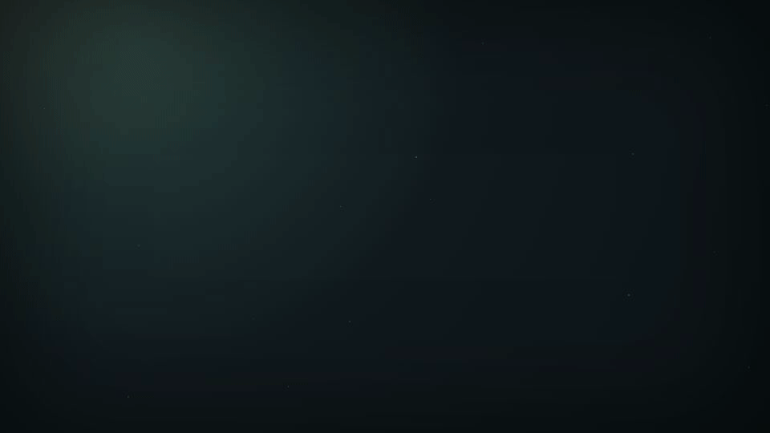
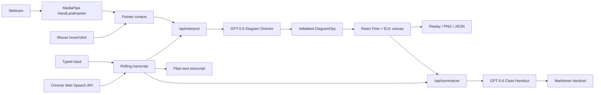

# Chalk — The Board That Draws Itself



Chalk is a live teaching board that listens to an explanation and grows a clean, animated concept diagram alongside it.

## What it does

Teachers can speak naturally, type an explanation, or load a sample lesson while Chalk turns the lesson into an evolving visual map. A webcam hand cursor and ordinary mouse controls let a teacher point at concepts, select two of them, and say “connect these two.” The completed lesson can be replayed, exported as a PNG or JSON session, downloaded as a final-text transcript, and turned into a grounded Markdown handout with a recap, glossary, and comprehension questions. It is designed to give visual learners and deaf or hard-of-hearing students a durable second channel for the meaning of a lesson.

## Track: Education

Chalk helps teachers explain and visualize at the same time, particularly in remote tutoring and classrooms without smartboard hardware. The resulting diagram, replay, and handout make an explanation easier for students to follow during class and revisit afterward.

## How GPT-5.6 is used

GPT-5.6 is the core of Chalk, not a bolt-on. The server-side **Diagram Director** interprets live speech, typed input, current board state, and gesture/mouse deixis into small batches of structured diagram operations. A second server-side GPT-5.6 integration, the **Class Handout generator**, uses only the completed diagram and transcript to create a grounded recap, glossary, and answered comprehension questions.

```ts
type NodeKind = "concept" | "actor" | "process" | "stage" | "data" | "example" | "note";
type LayoutHint = "flow" | "tree" | "timeline" | "cycle" | "radial";

type DiagramOp =
  | { op: "add_node"; id: string; label: string; kind: NodeKind; group?: string }
  | { op: "update_node"; id: string; label?: string; kind?: NodeKind }
  | { op: "remove_node"; id: string }
  | { op: "add_edge"; id: string; source: string; target: string; label?: string; directed?: boolean }
  | { op: "remove_edge"; id: string }
  | { op: "group_nodes"; id: string; label: string; nodeIds: string[] }
  | { op: "set_layout"; hint: LayoutHint }
  | { op: "highlight"; nodeIds: string[]; reason?: string }
  | { op: "clear_highlights" }
  | { op: "annotate"; nodeId: string; text: string }
  | { op: "no_op"; reason: string };
```

## Architecture



## How we built this with Codex

### Where Codex accelerated us

Codex scaffolded the strict TypeScript application, built the server-to-canvas operations pipeline, and helped iterate on layout, voice batching, export, persistence, and test coverage. It also traced practical platform constraints such as structured-output nullable fields, React Flow viewport coordinates, and safe PNG data handling.

### Key decisions we made ourselves

The idea came from my own learning experience. I tend to understand concepts much more easily when an explanation is accompanied by a visual representation rather than words alone. Some of the best educational videos on YouTube explain ideas by drawing diagrams and animations as they talk, and I found those visuals often made concepts click for me in a way that spoken explanations or text by themselves didn't. That inspired me to build Chalk, a tool that automatically creates those supporting visuals so teachers can explain naturally while students have a clear visual map to follow and revisit later.

We kept the Diagram Director prompt intentionally narrow: it reuses concepts before creating duplicates, treats speech as the ground truth, and resolves “these two” from visible pointer context. We also kept gesture scope to point, pinch, and open-palm swipe so every action has mouse and keyboard parity.

### How the collaboration worked

Most implementation started with a detailed specification that I wrote for Codex. I reviewed generated code, requested refactors when the architecture became too complex, and continually refined prompts based on testing. I was responsible for deciding the product scope, validating acceptance tests, and ensuring each feature fit the overall teaching experience before it was considered complete.

The product owner approved phase gates and tested the real interaction paths; Codex implemented focused increments, logged notable technical decisions in `DEVLOG.md`, and verified typecheck, lint, and tests before commits. That collaboration preserved a small, coherent scope while leaving a clear implementation record for the project.

## Local setup

Requirements: Node.js 20+ and **Chrome desktop** for live speech and webcam gestures. Typed input, samples, replay, and exports work without microphone or camera access.

```bash
git clone https://github.com/PRIEST099/chalk.git
cd Chalk
npm install
copy .env.example .env.local
```

Set these values in `.env.local`:

```dotenv
OPENAI_API_KEY=your_key_here
OPENAI_MODEL=gpt-5.6
```

Then run:

```bash
npm run dev
```

Open `http://localhost:3000`. The OpenAI key is used only by server-side route handlers and must never be committed.

## Judge Testing Guide

Hosted URL: <https://chalk-ebon.vercel.app/>

### First path: no microphone or camera (about 2 minutes)

1. Open the hosted URL in Chrome desktop, open the **⋯** menu (More lesson controls) in the bottom dock, and click **Load water-cycle sample**.
2. Watch Sun, Ocean, Evaporation, Condensation, Clouds, and Precipitation form an animated cycle.
3. Type `Actually, scratch that last part.` in the **Type instead** box at the bottom of the Captions panel and click **Draw**; the latest relevant element should be removed. **Undo** and **Redo** live in the **⋯** menu (or Ctrl/Cmd+Z and Ctrl/Cmd+Shift+Z).
4. Click the **Replay lesson** button in the dock, scrub the progress slider back and forth, then **Exit replay**; the live board remains intact.
5. Open the **Export** menu in the dock and click **Download handout**; inspect the diagram-grounded recap, glossary, questions, and answers.
6. From the same **Export** menu try **Export PNG**, **Save JSON**, and **Download transcript**; then use **Clear board** and **Load JSON** (both in the **⋯** menu) to restore the session.

### Microphone path

1. Click the **mic button** (Start listening) in the bottom dock and allow microphone access in Chrome.
2. Say a short lesson naturally; final transcript text should appear solid, interim text ghosted, and the status should move through Listening, Thinking, Drawing, and Idle.
3. Say a correction such as “Actually, scratch that last part” and confirm the board corrects itself. Click **Stop listening** to immediately stop recognition and pending interpretation.

### Camera and gesture path

1. Click the **camera button** (Enable hand tracking camera) in the bottom dock and allow camera access; the presenter tile at the bottom-right of the board shows your mirrored video with hand landmarks.
2. Point at a node for about half a second to show its warm outer ring, pinch to fill and check-mark it as selected, then pinch a second node.
3. Say “connect these two” to create the edge. Open your palm and swipe left to undo.
4. Deny camera access to confirm the friendly fallback; mouse hover, click selection, and Ctrl/Cmd+Z remain fully usable.

## License

[MIT](LICENSE)
